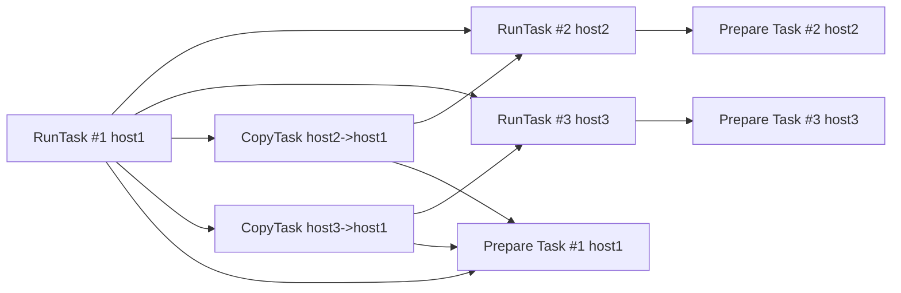

# Статистика
## Статистика исполнения на distbuild
Источником данных об исполненных задачах является лог, получаемый из distbuild. Код формирования лога в distbuild находится в файлах [execution_log.cpp](https://a.yandex-team.ru/arcadia/devtools/distbuild/libs/execution_log/execution_log.cpp?rev=r15489511) и [execution.cpp](https://a.yandex-team.ru/arcadia/devtools/distbuild/worker/queues/execution.cpp?rev=r15489511).

NOTE: Информация, изложенная в этом пункте, получена путём reverse engineering, поэтому к ней нужно относиться с осторожностью. По этой же причине приведен только самый минимум, необходимый для понимания кода обработки лога в ya-bin.

## События
 В логе присутствуют события для задач:
- подготовка репозитория и ресурсов на воркере;
- доставка сборочных зависимостей на воркер;
- непосредственное исполнение команд узла сборочного графа.

Каждое событие располагается на отдельной строке и состоит из полей, разделённых пробелами. Идущие подряд пробелы нельзя склеивать, так как два пробела подряд означают наличие между ними пустого поля. Первым полем идёт время в миллисекундах (далее обозначено как `<TIME>`), вторым полем - тип события. Остальные поля зависят от типа события.
События в логе могут идти не в порядке их возникновения, то есть сортировка по времени не гарантируется.

### Подготовка репозитория и ресурсов на воркере
События:
```
<TIME> prepare_start <EMPTY> <WORKER-ID>
<TIME> repository_prepared <PATTERN> <WORKER-ID>
<TIME> resources_prepared <EMPTY> <WORKER-ID>
```
Событие `prepare_start` обозначает старт всех подготовительных задач на хосте. Окончание каждой подготовительной задачи идёт отдельным событием: `repository_prepared` или `resources_prepared`. Событий `repository_prepared` может быть несколько - по одному для каждого `PATTERN`.
Следует обратить внимание, что события не содержат имя хоста - только `worker_id`. Чтобы привязать `worker_id` к хосту нужно проанализировать другие типы событий (об этом далее).

### Доставка зависимостей
События:
```
<TIME> dep_start <UID> <DEST-HOST> <DEP-UID> <DEP-COUNT>
<TIME> dep_wait <UID> <DEST-HOST> <DEP-UID> <DEP-COUNT>
<TIME> dep_finished <UID> <DEST-HOST> <DEP-UID> <ORIGIN-HOST> <SIZE>

<TIME> dep_extract_queue <DEP-UID> <DEST-HOST> <ORIGIN-HOST>
<TIME> dep_extract_start <DEP-UID> <DEST-HOST> <ORIGIN-HOST>
<TIME> dep_extract_finish <DEP-UID> <DEST-HOST> <ORIGIN-HOST>
```
Одно из событий `dep_start` или `dep_wait` отмечает время начала доставки зависимости, а `dep_finished` - время окончания. Для каждого `DEP-UID`, от которого зависит исполняемый узел, генерируется своя последовательность событий доставки. `DEST-HOST` - это хост, где будет исполняться задача, для которой доставляются зависимости. `ORIGIN-HOST` - хост, с которого привозятся артефакты. Источник и получатель могут совпадать.
События `dep_extract_*` - размечают внутренние стадии задачи доставки.

### Исполнение узла графа
События:
```
<TIME> deploy <UID> <WORKER-ID> <READY-TASK-COUNT>
<TIME> deployed <UID> <HOST>

<TIME> started <UID> <HOST>
<TIME> finished <UID> <HOST> <STATUS> <SIZE>
<TIME> finished_from_cache <UID> <HOST_OR_WORKER_ID> <STATUS> <SIZE>
```

События `deploy` и `deployed` происходят в самом начале ещё до привоза зависимостей. События `deployed` может не быть, если артефакт есть в кэше distbuild: в этом случае после `deploy` сразу происходит событие `finished_from_cache`. Следует отметить, что в поле `HOST_OR_WORKER_ID` может приходить как имя хоста, так и номер воркера.

Начало и конец исполнения узла сборочного графа отмечаются событиями `started` и `finished`.

## Детали обработки лога
Для хранения атрибутов событий служат классы:
- `PrepareTask` - подготовка воркера;
- `CopyTask` - доставка зависимостей;
- `RunTask` - исполнение узла или извлечение готового артефакта из кэша.

Из-за того, что порядок прихода событий не гарантируется, задачи создаются по приходу соответствующих событий, либо в частично заполненном виде (`RunTask`), либо события сохраняются в отдельных словарях, пока не придёт всё необходимое для заполнения атрибутов задачи (`PrepareTask` и `CopyTask`).

События `dep_extract_*`, которые описывают внутренние стадии копирования, сознательно игнорируются. Для этого есть две причины:
- первая и основная: имеющихся у события атрибутов недостаточно, чтобы только по ним найти соответствующую задачу (ключ `<DEP-UID> <DEST-HOST> <ORIGIN-HOST>` не является уникальным). А искать её ещё и по времени трудоёмко и ненадёжно.
- вторая: непонятно, чем эта информация может помочь пользователю.

События подготовки репозитория и некоторые события `finished_from_cache` не содержат имя хоста. Для того, чтобы его получить, используется событие `deploy`, в котором есть как `WORKER_ID`, так и `UID`. Зная эти атрибуты, из событий `deployed`, `started` или `finished` можно получить соответствующее этому `UID` имя хоста. В наивной реализации можно было бы накапливать связи `UID->WORKER_ID` и `UID->HOST` до конца парсинга лога и затем в конце произвести замену `WORKER_ID` на `HOST`. Но такой подход требует много памяти, поэтому был сделан чуть более сложный вариант, в котором связи накапливаются только до момента получения всех данных подстановки, а затем накопленное удаляется. Хотя гарантий порядка событий нет, но на практике в логе всё нужное находится близко друг к другу, и промежуточные данные существуют недолго.

## Формирование зависимостей
Специально для расчёта критического пути после создания объектов, описывающих выполненные задачи, между объектами формируются зависимости. Назовём это графом зависимостей. Если говорить о локальном исполнении, то в этом графе присутствуют только `RunTask`, а источником информации о зависимостях служит сборочный граф. В случае исполнения на distbuild, всё устроено сложнее. Во-первых, в граф зависимостей добавляются `PrepareTask`, во-вторых, зависимости формируются не только между `RunTask` - на основании сборочного графа, но и между `RunTask` и `CopyTask`, чтобы показать время, которое вносит копирование артефактов между воркерами. Так же, все задачи, которые исполнялись на хосте, зависят и от `PrepareTask`, которые этот хост подготавливали. Ещё одно важное замечание: для упрощения графа зависимостей для каждого из воркеров используется только самая долгая из всех `PrepareTask`, так как более короткие гарантированно не лежат на критическом пути.
Например, если узел исполнения #1 зависит от узлов #2 и #3, а узлы #2 и #3 не зависят от других узлов, то диаграмма зависимостей может выглядеть так:

