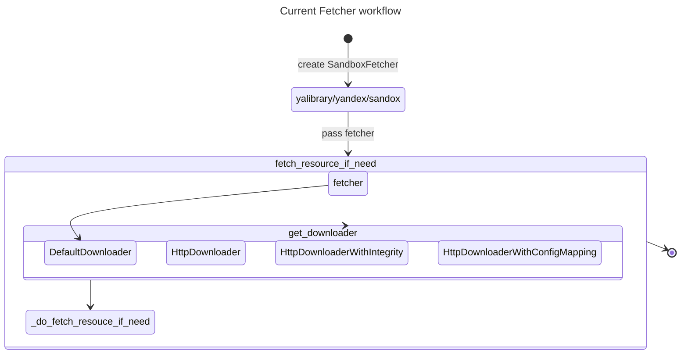
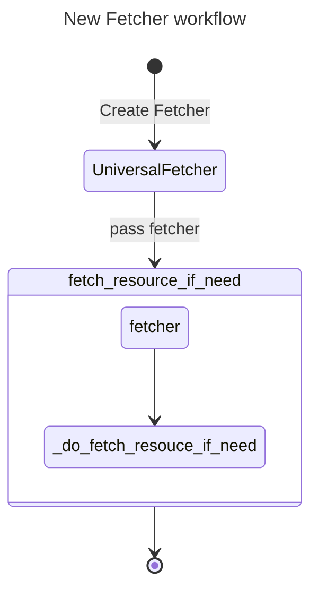
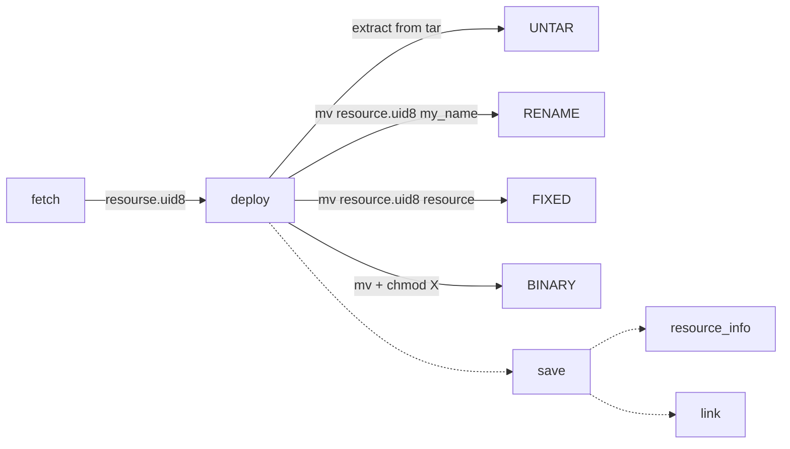

# Fetcher Design Doc

## Текущий дизайн фетчера
Про некоторые детали можно узнать [тут](https://wiki.yandex-team.ru/users/say/fetcher/)

## Дизайн использования универсального фетчера

### Особенности универсального фетчера
    1) Универсальный фетчер настраивается через [конфиг](https://a.yandex-team.ru/arcadia/devtools/experimental/universal_fetcher/example_config.json?rev=r14412218)
    2) Имеет 3 сабфетчера: 
        a) http
        b) docker
        c) sandbox со следующими транспортами: mds, http, skynet
    3) Может иметь кастомный фетчер, который будет вызываться вместо сабфетчеров
    4) Имеет rate-limiter на progress callback (для того, чтобы не дергать GIL часто). Интерфейс коллбека следующий `fn(downloaded, total_size)`

### Детали, требующие внимания
1. В OS сборке у нас нету доступа к Sandbox. Перед тем, как сфетчить ресурс, нужно взять из маппинга новую ссылку на ресурс

2. HTTP и DOCKER фетчеры могут не иметь оригинального наименования ресурса, его размера, прав. Поэтому для сохранения информации о ресурсе (в resource_info.json) мы самостоятельно предзаполняем дефолтные значения `file_name` и `id`

3. Есть такая штука, как пост-процессинг скачанного файла, настройки такого пост-процессинга передаются в параметрах install_params метода fetch_resource_if_need

4. Зачастую (но не всегда, смотри в кодсчерч), ресурсы имеют пост-процессинг FIXED в `resource`, т.к в графе команд ожидается, что ресурс приедет с таким наименованием

5. Мы скачиваем файл с рандомным именем, а только потом делаем move (т.к mv атомарный)

6. Рандомное имя должно по идее уйти, т.к универсальный фетчер возьмет на себя эту ответсвенность

7. Есть HTTP ресурсы, которые имеют [integrity](https://wiki.yandex-team.ru/fei/frontend-build-platform/rfc/resource-https-schema/)

### Немного про то, как сейчас внедрен фетчер
- Доступен opt-in через параметр `--use-universal-fetcher-everywhere`
- Пока что НЕ работает для: opensource, windows, py2
