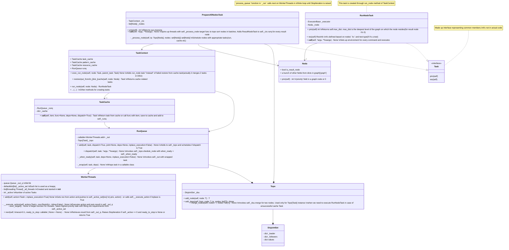

# High-level runner schema

```mermaid
classDiagram
    note "`process_queue` function in `_run` calls next on WorkerThreads in infinite loop until StopIteration is raised"
    Topo --* DisjointSet
    RunQueue --> WorkerThreads
    RunQueue --* Topo
    TaskCache --> RunQueue
    TaskContext --> "3" TaskCache
    TaskContext --> RunQueue
    PrepareAllNodesTask --> TaskContext
    PrepareAllNodesTask --> "*" Noda
    PrepareAllNodesTask --* Topo
    PrepareAllNodesTask ..|> Task
    RunNodeTask --> "1" Noda
    RunNodeTask ..|> Task
    note for Task "Made up interface representing common members.\nIt's not in actual code "
    class Task{
        <<interface>> 
        prio(self)
        res(self)
    }
    class WorkerThreads{
      - queue.Queue _out_q \nStd lib
      - defaultdict[list] _active_set \nEach list is used as a heapq
      - list[threading.Thread] _all_threads \nCreated and started in __init__
      - int _active \nNumber of active Tasks
      + add(self, action~Task~, inplace_execution=True) None \nGets res from action and pushes to self._active_set[res] \n(-prio, action) or calls self.__execute_action if inplace is True
      - __execute_action(self, action~Task~, res~ResInfo~, inline=False) None \nExecutes action and puts result in self._out_q
      - exec_target() None \nTarget function for threads. Takes highest priority task with fitting res requirements from self._active_set
      + next(self, timeout=0.1, ready_to_stop: callable | None = None): None \nRetrieves result from self._out_q. Raises StopIteration if self._active == 0 and ready_to_stop is None or returns True
    }
    class Topo~T~{
        - DisjointSet _dsu
        + add_node(self, node: T) T
        + add_deps(self, from_node: T, to_nodes: list[T]) None
        + merge_nodes(self, node1: T, node2: list[T]) None \nInvokes self._dsu.merge for two nodes. Used only for Topo[Task] instance \nwhen we need to execute RunNodeTask in case of unsuccessful cache Task
    }
    class DisjointSet{
        - dict _leader
        - dict _followers
        - dict values
    }
    class RunQueue{
        - callable~WorkerThreads.add~ _out
        - Topo[Task] _topo
        + add(self, task, dispatch=True, joint=None, deps=None, inplace_execution=False) None \nAdds to self._topo and schedules if dispatch is True
        + dispatch(self, task, *args, **kwargs) None \nInvokes self._topo.shedule_node with when_ready = self._when_ready
        - _when_ready(self, task, deps=None, inplace_execution=False) None \nInvokes self._out with wrapped task
        - _wrap(self, task, deps) None \nWraps task in a callable class
    }
    class TaskCache{
        - RunQueue _runq
        - dict _cache
        + __call__(self, item, func=None, deps=None, dispatch=True) Task \nReturn task from cache or call func with item, save to cache and add to self._runq
    }
    class TaskContext{
        + TaskCache task_cache
        + TaskCache pattern_cache
        + TaskCache resource_cache
        + RunQueue runq
        + exec_run_node(self, node: Task, parent_task: Task) None \nAdds run_node task "instead" of failed restore from cache task (actually it merges 2 tasks in DSU)
        + restore/put_from/in_[dist_]cache(self, node: Noda) Task \nReturns cache related tasks
        + run_node(self, node: Noda) RunNodeTask
        + ...(...) \nOther methods for creating tasks
    }
    class PrepareAllNodesTask{
        - TaskContext _ctx
        - list[Noda] _nodes
        + prio(self) int \nReturns sys.maxsize
        + __call__(self, *args, **kwargs) None \nSpins up threads with self._process_node target func to topo sort nodes in batches. Adds ResultNodeTask to self._ctx.runq for every result node
        - _process_node(self, tp: Topo[Noda], nodes: set[Noda]) set[Noda] \nSchedule nodes with appropriate tasks (run, cache etc)
    }
    note for RunNodeTask "This task is created through run_node method of TaskContext"
    class RunNodeTask{
        - ExecutorBase _executor
        - Noda _node
        + prio(self) int \nReturns self.max_dist. max_dist is the deepest level of the graph on which the node resides (for result node it's 0)
        + res(self) ResInfo \nIt's defined based on nodes' `kv` and test type (if it's a test)
        + __call__(self, *args, **kwargs) None \nSets up environment for every command and executes
    }
    class Noda{
        + bool is_result_node
        + a bunch of other fields from dicts in graph['graph']
        + prio(self) int \n'priority' field in a graph node or 0
    }
```
